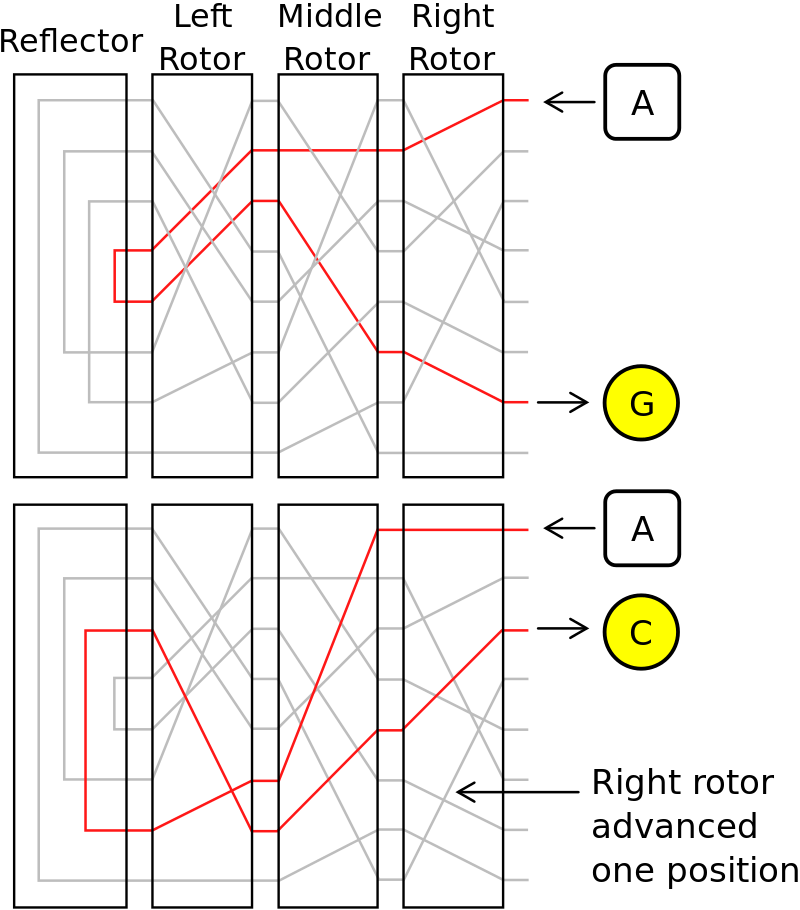

# Enigma Machine Simulator

## Enigma Machine made using Python and PyGame


This is a personal project which is supposed to emulate the ENIGMA Machine, which was used in WWII as a cryptic communication device by Germany.

- This is made using different data types in python 
- The front end is made using PyGame

### To use this you will need PyGame isntalled and cloned the repo, then just launch main.py 

## Information about the Enigma Machine

### Basic Scrambling action of an ENIGMA :




The Following Rotor Wirings & Reflectors from were used from the original German Army and Navy[1].

|Rotor #|	ABCDEFGHIJKLMNOPQRSTUVWXYZ|	Date Introduced	|Model Name & Number|
| --- | ----------- | --- | ----------- |
|I	|EKMFLGDQVZNTOWYHXUSPAIBRCJ	|1930	|Enigma I|
|II	|AJDKSIRUXBLHWTMCQGZNPYFVOE	|1930	|Enigma I|
|III	|BDFHJLCPRTXVZNYEIWGAKMUSQO	|1930	|Enigma I|
|IV	|ESOVPZJAYQUIRHXLNFTGKDCMWB	|December 1938	|M3 Army|
|V	|VZBRGITYUPSDNHLXAWMJQOFECK	|December 1938	|M3 Army|
|Reflector A	|EJMZALYXVBWFCRQUONTSPIKHGD		||
|Reflector B	|YRUHQSLDPXNGOKMIEBFZCWVJAT		||
|Reflector C	|FVPJIAOYEDRZXWGCTKUQSBNMHL||

- One can use any of these 5 Rotor settings and change the code accordingly.

```python
# Enigma Rotor and Reflectors Setings from the orignal WWII Era
I = rotor("EKMFLGDQVZNTOWYHXUSPAIBRCJ", "Q")
II = rotor("AJDKSIRUXBLHWTMCQGZNPYFVOE", "E")
III = rotor("BDFHJLCPRTXVZNYEIWGAKMUSQO", "V")
IV = rotor("ESOVPZJAYQUIRHXLNFTGKDCMWB", "J")
V = rotor("VZBRGITYUPSDNHLXAWMJQOFECK", "Z")
A = reflector("EJMZALYXVBWFCRQUONTSPIKHGD")
B = reflector("YRUHQSLDPXNGOKMIEBFZCWVJAT")
C = reflector("FVPJIAOYEDRZXWGCTKUQSBNMHL")


#keyboard and plugboard specifics
KB=keyboard()
PB=plugboard(["AB", "CD", "EF"])
# One can change all the settings of the plugboard from here 
# If you want to connect B-->D Then change the PB strings to ["BD"]

#Enigma machine settings
ENIGMA = enigma(B,I,II,III,PB,KB)
# This is the Main settings for the machine
# One can change the rotors(I,II,III,IV,V) and the Reflectors(A,B,C)


#Enigma Ring Settings
ENIGMA.set_rings((1,1,1))
# Changing the Notches on the rotors(rotor in position 1, 2, 3) 

#seting the Enigma Key
ENIGMA.set_key("CAT")
# This is where you can change the Rotor start keys
```
### A look at the Project


### This Project was inspired and learnt from the youtube channel Coding Cassowary[2].

### The Enigma Machine Simulator by Mike Koss was used to verify the workings of this machine[3]

#### Refrences
The Following sources were used to make this possible :
- [1]https://en.wikipedia.org/wiki/Enigma_rotor_details
- [2]https://www.youtube.com/watch?v=sbm2dmkmqgQ
- [3]https://mckoss.com/enigma-simulator-js/
- https://en.wikipedia.org/wiki/Enigma_machine
- https://crypto.stackexchange.com/questions/29315/how-does-the-ring-settings-of-enigma-change-wiring-tables#:~:text=The%20rotors%20have%20a%20ring,A%20position%20on%20the%20rotor.
